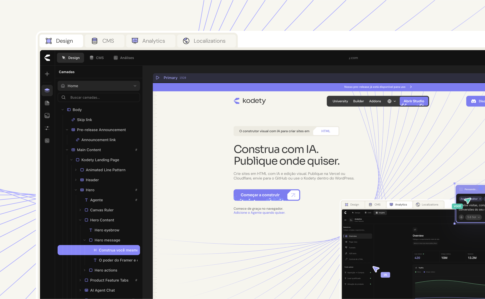

# Onun Kodety — Open Source Alternative to Framer & Webflow

**Design visually. Own your code. Publish on your WordPress.**

Onun Kodety is an open-source visual website builder for WordPress, developed by [Onun](https://github.com/onunbeai). Import an HTML website, edit its layout and styles in the visual builder, and publish through your own WordPress installation.

This repository contains the **WordPress plugin and its shared editor core**. It includes visual HTML/CSS editing, reusable components, responsive layouts, CMS integration, and editable animations powered by the MIT-licensed Motion engine. There is no commercial activation, serial key, or required Kodety account in this edition.

Looking for the standalone HTML version? **Kodety Studio is available through [kodety.com/en](https://kodety.com/en).**

## Install the WordPress plugin

Requirements: **WordPress 6.4+** and **PHP 8.0+**. Building from source also requires **Node.js 22.12+**, or a supported Node.js 24/26 release, and npm.

```sh
git clone https://github.com/onunbeai/onun-kodety.git
cd onun-kodety
npm ci
npm run build
```

The build creates an installable plugin ZIP at `Wordpress/dist/<version_with_underscores>.zip`.

1. In WordPress, open **Plugins → Add New Plugin → Upload Plugin**.
2. Upload the generated ZIP and activate **Onun Kodety**.
3. Open Onun Kodety from the WordPress admin area. The editor route remains `/kodety` for compatibility.

WordPress authentication and user permissions still apply. Optional integrations and AI providers use your own credentials and infrastructure and may have separate costs.

## Develop locally

Install dependencies with `npm ci`, then use `Wordpress/kodety/` as the plugin directory in a local WordPress installation—for example, by linking it to `wp-content/plugins/kodety`. Build the plugin once with `npm run build` before activating it.

```sh
# Watch and rebuild the WordPress editor assets
npm run dev

# Build an installable plugin ZIP
npm run build
```

The development command watches the plugin assets. Open the builder through your local WordPress installation and reload after rebuilding. WordPress supplies the backend, authentication, storage, and publishing environment.

## Verify changes

```sh
# Install the browser used by browser regressions
npx playwright install chromium

# Run the WordPress validation and build gate
npm run verify

# Run the broader regression suite
npm test
```

Tests against a real WordPress installation require local configuration. See the [installed WordPress testing guide](docs/guides/wordpress-installed-e2e.md) and the [validation record](docs/validation.md) for coverage and known limits.

## Repository structure

| Path | Purpose |
| --- | --- |
| `Wordpress/kodety/` | Plugin PHP, authentication, APIs, and publishing |
| `Wordpress/editor/` | WordPress editor entry points and integration |
| `app/(builder)/kodety/html-editor/` | Visual editor interface |
| `lib/html-editor/` | Shared parser, editing, CSS, project, preview, and publishing logic |
| `packages/` | Shared component SDK, compiler, and bridges |
| `docs/` | Architecture, development, and integration guides |

Internal identifiers such as `kodety`, `KODETY_*`, and `@coday/*` are retained for compatibility with existing projects and integrations.

## Contributing

Read [CONTRIBUTING.md](CONTRIBUTING.md) for development guidelines and [SECURITY.md](SECURITY.md) for vulnerability reporting. The [open-source preparation notes](docs/open-source-preparation.md) describe the repository's scope and cleanup.

## Acknowledgments

Parts of Onun Kodety were developed from the open-source [Ycode repository](https://github.com/ycode/ycode), particularly the editor architecture. Thank you to the Ycode team and community for sharing that foundation.

Ycode-derived code retains its MIT license and copyright notices, preserved in [licenses/YCODE-LICENSE.md](licenses/YCODE-LICENSE.md). Onun Kodety's own contributions are distributed under GPL-3.0-only.

## License

Original Onun Kodety code is licensed under [GNU GPL v3.0](LICENSE), SPDX `GPL-3.0-only`. Third-party code and assets retain their respective licenses and attributions; see [THIRD_PARTY_NOTICES.md](THIRD_PARTY_NOTICES.md).
